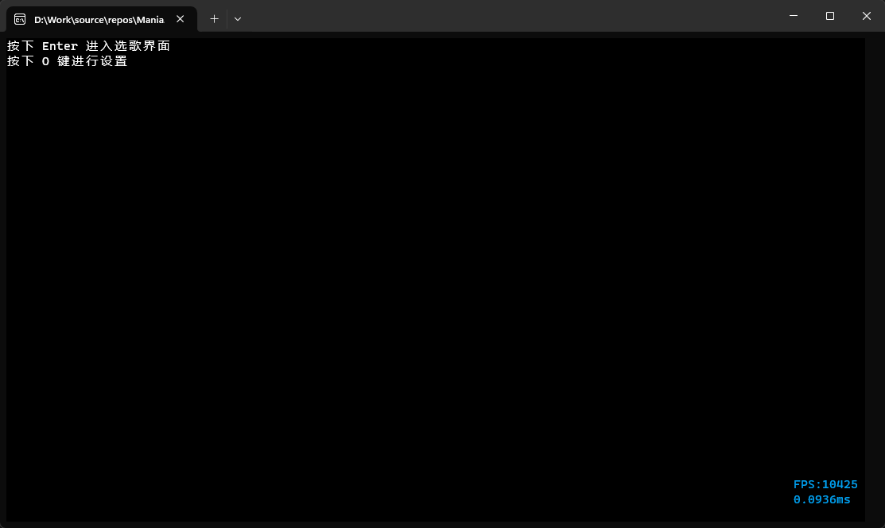
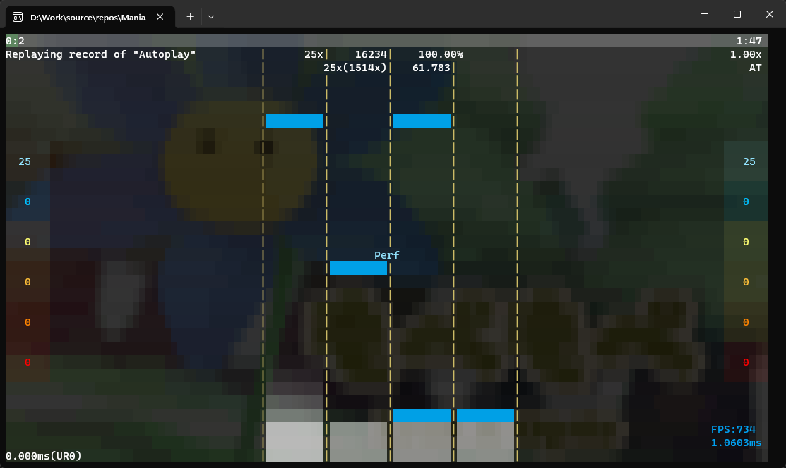
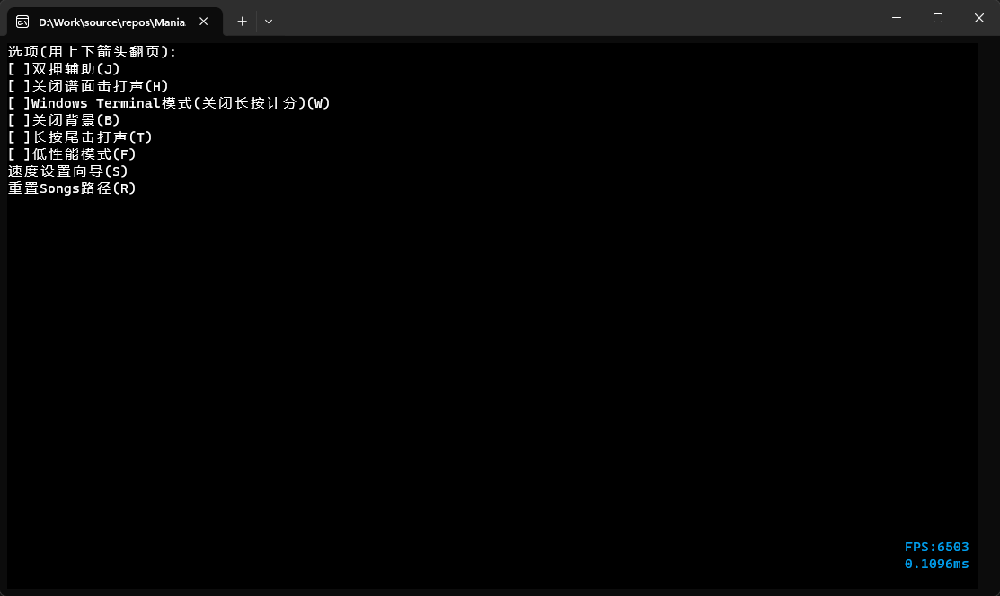
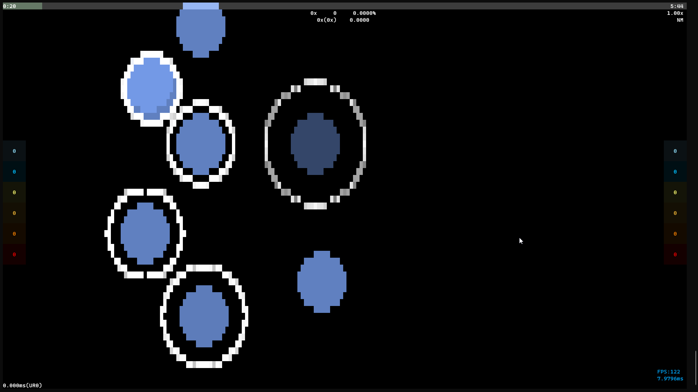
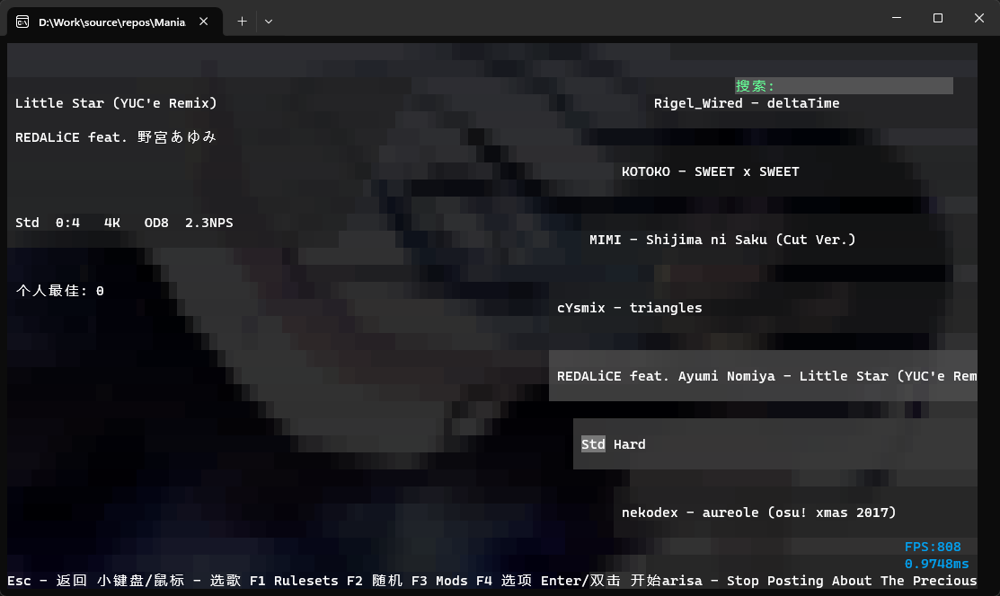
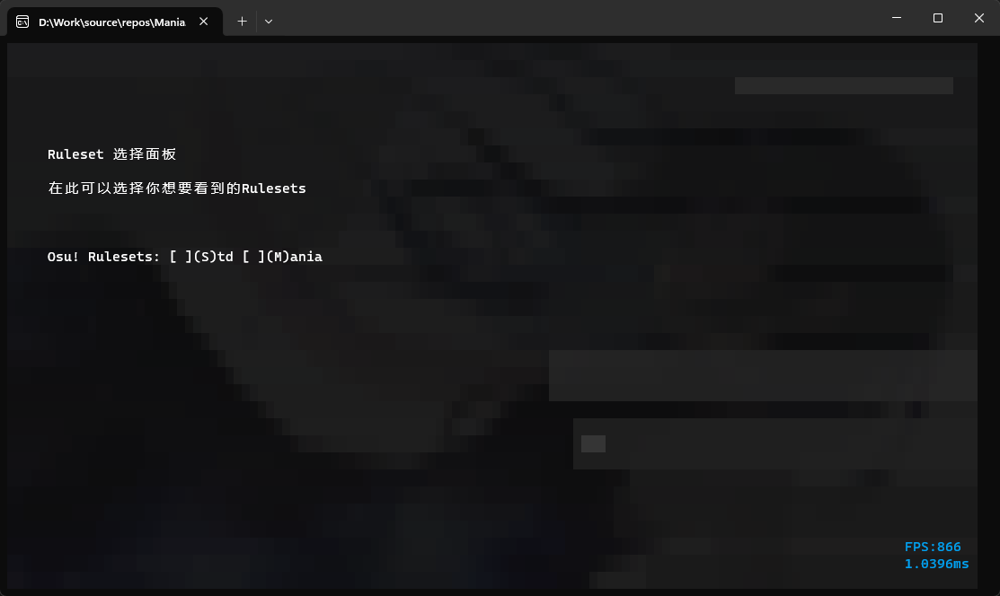

## Mania.Console.Cxx

[Chinese ver.](README.md)

*This is translated by AI, see Chinese ver for a more accurate introduction.*

Play osu!mania on your Windows Terminal (and maybe linux?)














## Supported Features
- Play osu!mania game in terminal
- Keyboard input support, keybinding is dfjk (same as osu!mania default)
- Beatmap metadata cache support (and metadata-based search)
- Replay and recording support
- Compatible with standard osu!mania beatmap format (4k/7k/...)
- Bass audio engine
- Beatmap difficulty calculation
- Ruleset api
- Rating

## Features in progress/coming soon
- ~Extended Ruleset support~ Done
- Linux support
- Scoreboard
- Multiplayer

## Planned features for the future
- Replay related UI
- Rating
- Player profile
- More game mode support (osu!taiko osu!catch osu!std)
- osu!mania variable speed beatmap support
- Ruleset extension loading
> I might not actively maintain this project because of school work (I'm in high school now)

## Download and install

Please note that the binaries in Release might be outdated. It is recommended to clone the code and build the latest version yourself by following these steps:

> You can now directly go to this project's Github Actions to get automatic builds (not every automatic build is usable)

1. Clone the repository: (You can also do this in Visual Studio's graphic interface)

   ```
   git clone https://github.com/telecomadm1145/cmania.git
   ```

2. Build the project: (You can also do this in Visual Studio's graphic interface)

   ```
   cd cmania
   msbuild
   ```

3. Make sure your system has the required dependencies installed (like Visual Studio 2022(or its Build Tools)'s C++ workload, Bass audio engine, etc.), remember to restore Nuget packages.

4. Debug&&Start!

## About beatmap folder

Cmania uses the same beatmap folder structure as osu!. You can download osu!mania beatmaps from `osu.ppy.sh` , and extract them(osz is zip archive actually) to a new created Songs folder. The folder structure should look like this:

```
Songs
├── 114514
│   ├── 114514.osu
│   ├── audio.mp3
│   └── ...
├── ...
```

## Contributing

Contributions to this project are welcome! If you find a bug, have a suggestion for a new feature or would like to improve some other aspect of the project, please open an Issue or submit a Pull Request.

Please understand the art of asking questions, make sure you provide correct information when submitting.

## Contact me

Gmail: mailto:telecomadm1919@gmail.com

Osu: https://osu.ppy.sh/u/telecomadm1145

## License

MIT License

See [LICENSE](LICENSE) file for more information.

Built-in audio samples are not under MIT License, third party libraries used in the project remain their original license

## Thanks

Bass: https://www.un4seen.com/

osu!lazer: https://github.com/ppy/osu

osu!: https://osu.ppy.sh

stb_image: github.com/nothings/stb
