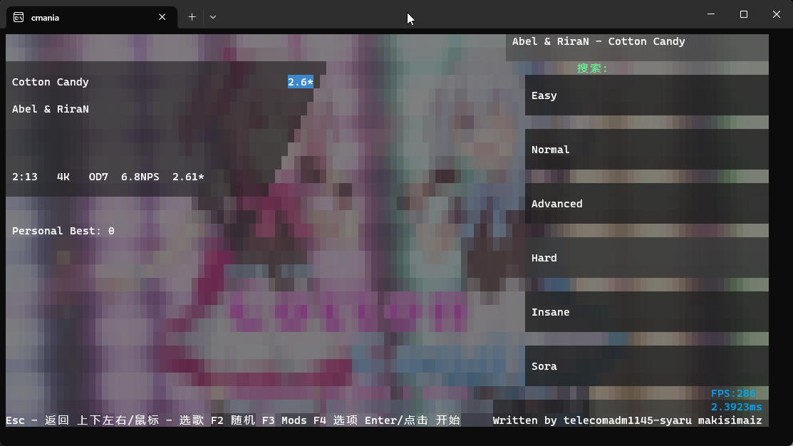

# Mania.Console.Cxx
[Chinese ver.](README.md)

Play osu!mania on a Windows terminal (maybe Linux too?)




## Features
- Play osu!mania game on a Windows terminal
- Supports keyboard input with key bindings as dfjk (same as the default key bindings in osu!mania)
- Supports caching of beatmap metadata
- Supports recording and replaying
- Compatible with standard osu!mania beatmap formats (4k/7k/...)
- Includes a wrapper library for the Bass audio engine
- Uses Hpet timer for timing
- Difficulty calculation similar to the original osu!mania
- Rating calculation

## Work in Progress Features
- Recording and replaying may not be stable
- Rating calculation
- Player profiles
- Ruleset support

## Planned Features
- Multiplayer online
- Support for more game modes (osu!std, osu!taiko, osu!catch)
- Variable speed beatmap support
- Ruleset extension loading
- Linux support

> I may not actively maintain this project due to academic reasons, but I might maintain it until August 30, 2023, during this summer vacation.

## Download and Installation

Please note that the binary files in the Releases section may be outdated. It is recommended to clone the code and compile the latest version using the following steps:

1. Clone the repository:

   ```
   git clone https://github.com/telecomadm1145/cmania.git
   ```

2. Build the project: (You can also use Visual Studio for compilation)

   ```
   cd cmania
   msbuild
   ```

3. Make sure you have the required dependencies installed on your system (such as C++ workload, Bass audio engine, etc.).

4. Run Cmania:

## About the Songs Folder

Cmania uses the same Songs folder structure as osu!. You can download osu!mania beatmap files from osu.ppy.sh and extract them into a newly created "Songs" folder. The folder structure should look like this:

```
Songs
├── 114514
│   ├── 114514.osu
│   ├── audio.mp3
│   └── ...
├── ...
```

## Contribution

Contributions to this project are welcome! If you find any bugs, have suggestions for new features, or want to improve other aspects of the project, please raise an Issue or submit a Pull Request.

Please understand the art of asking questions and provide accurate information when submitting.

## License

This project is licensed under the MIT License. For more information, see the [LICENSE](LICENSE) file.
