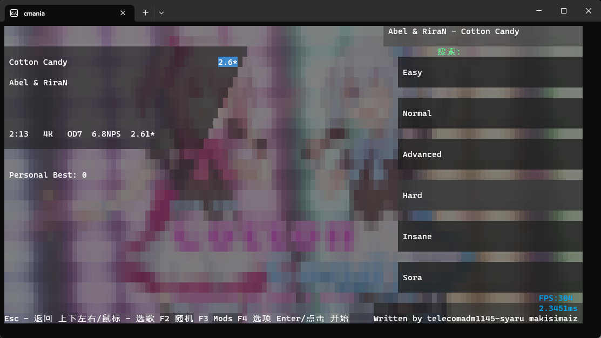
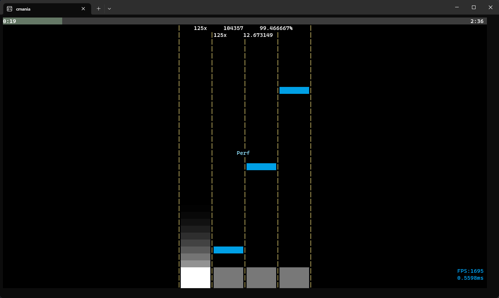

# Mania.Console.Cxx
[English ver.](README.en.md)

在 Windows 终端(也许linux?)上玩 osu!mania





## 功能
- 在终端上运行 osu!mania 游戏
- 支持键盘输入，键位绑定为 dfjk (与原osu!mania默认键位一致)
- 支持缓存谱面元数据
- 支持录像和回放
- 兼容标准的 osu!mania 谱面格式(4k/7k/...)
- 包含 Bass 音频引擎的封装库
- 使用 Hpet 定时器计时
- 与 osu!mania 原版类似的难度计算
- Rating 计算

## 正在进行中的功能
- 回放相关 UI
- Rating
- Player 档案
- 扩展 Ruleset 支持
- osu!std 支持

## 未来计划的功能
- 多人联机
- 更多游戏模式的支持（osu!taiko osu!catch）
- 变速谱面支持
- Ruleset 扩展加载
- Linux 支持

> 本人可能会因为学业问题不会积极维护此项目(已上高中)

## 下载与安装

请注意，Release 中的二进制文件可能过时。建议按照以下步骤自行克隆代码并编译最新版本：

> 您现在可以直接去此项目的 Actions 获取自动构建（不一定每一个自动构建都可用）

1. 克隆代码库：

   ```
   git clone https://github.com/telecomadm1145/cmania.git
   ```

2. 编译项目：（你也可以使用 Visual Studio 进行编译）

   ```
   cd cmania
   msbuild
   ```

3. 确保你的系统已安装所需的依赖项（如C++负载、Bass 音频引擎等）。

4. 运行 Cmania：

## 关于谱面文件夹

Cmania 使用与 osu! 相同的谱面文件夹结构。你可以从 osu.ppy.sh 或者 osu.sayobot.cn（镜像）下载 osu!mania 的谱面文件，并将其解压缩到新建的 Songs 文件夹中。文件夹结构应如下所示：

```
Songs
├── 114514
│   ├── 114514.osu
│   ├── audio.mp3
│   └── ...
├── ...
```

## 贡献

欢迎对该项目进行贡献！如果你发现了 bug、有新功能的建议或者愿意改进项目的其他方面，请提出 Issue 或者提交 Pull Request。

请理解提问的艺术，确保提交正确的信息。

## 许可证

该项目基于 MIT 许可证。详细信息请参阅 [LICENSE](LICENSE) 文件。
